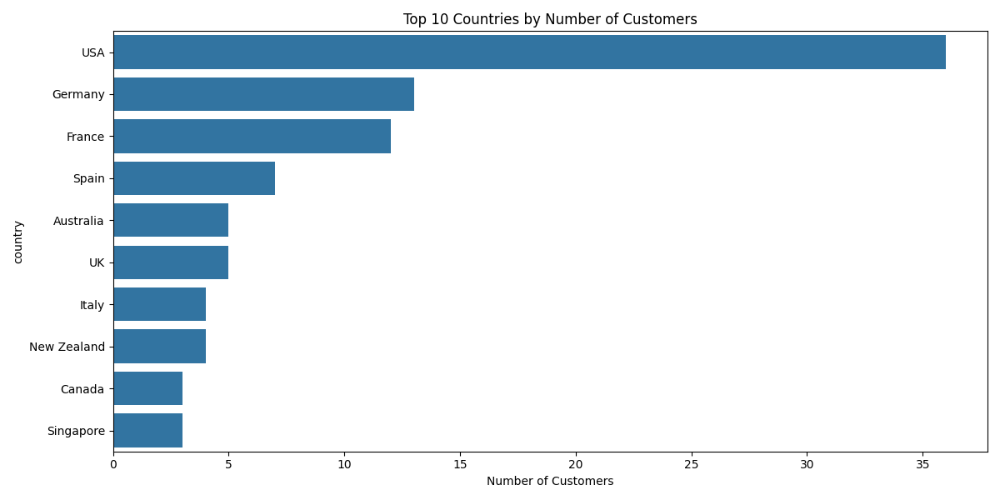
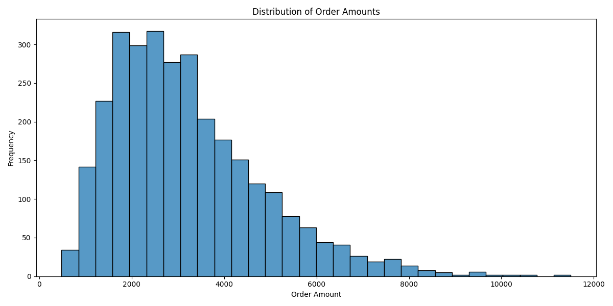
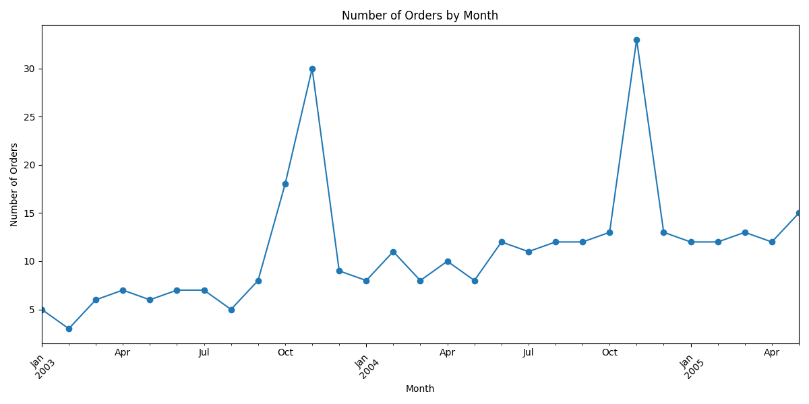
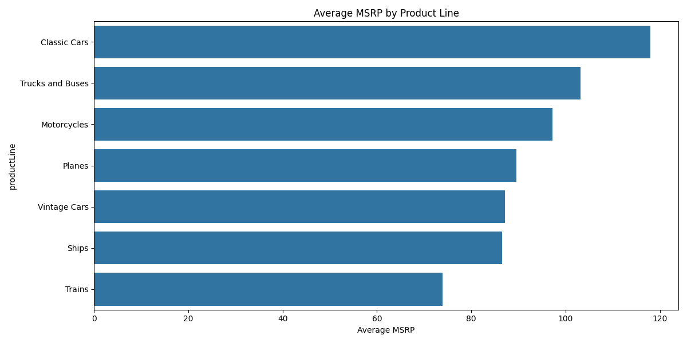

# ClassicModels 데이터를 대시보드에 구현

## 주요 목표
- 국가 별 고객수 막대그래프로 구현
- 신용한도 분포를 히스토그램으로 구현

### 구현을 완료한 Streamlit 대시보드
[Streamlit](https://mysqlcrudtest-dksr3zemqxywypebysdoeb.streamlit.app/)

### 구현 이미지 예시

- 메인 페이지

- 소비자 분포

- 매출액 분포

- 월 별 매출액 분포

- 상품 가격 분포

- 실행 동작 예시
