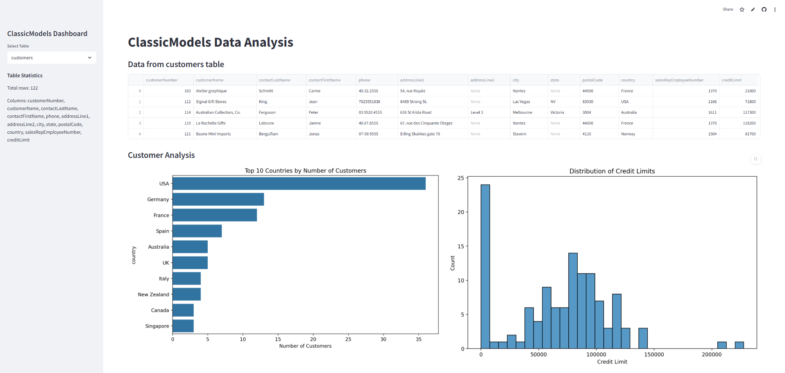
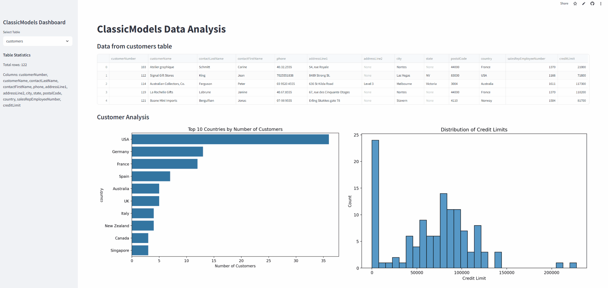

# mysql_crud_test

# 첫번째 미션(5-6교시)
-- sqlite3 생성 후, classicmodels 쿼리 추가하는 방법

# streamlit으로 대시보드 개발
-- sqlite3와 연결

# 대시보드 디자인 시작
-- 테스트 완료 후

# 배포 deploy, streamlit 웹사이트

# README.md 페이지 구성
-- 7교시, 8교시, README.md 페이지 구성할 떄,
-- 마크다운 문법을 익히기

# ClassicModels 데이터를 대시보드에 구현

## 주요 목표
- 국가 별 고객수 막대그래프로 구현
- 신용한도 분포를 히스토그램으로 구현

- 구현을 완료한 Streamlit 대시보드
[Streamlit](https://mysqlcrudtest-dksr3zemqxywypebysdoeb.streamlit.app/)

- 구현 예시 이미지

- 실행 동작 예시
